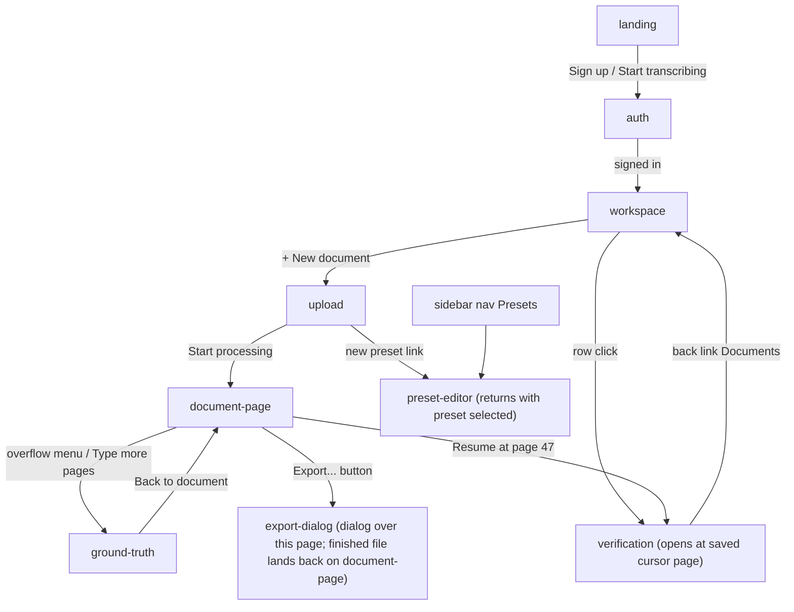

# Transcripta — Design Package

This folder is the exported, PO-approved design for Transcripta, built in claude.ai/design ("Claude Design"): an **Ink & Paper** design system plus every product screen as an interactive HTML prototype (`*.dc.html`). [`prompts.md`](prompts.md) is the runbook that generated all of it — per-stage prompts, checklists, and decisions. The editable source projects live in Claude Design under the product owner's account; this folder is the frozen export and the team's single source. To change a screen, ask the PO — the change is made in the source project and re-exported here.

## Running locally

Serve **this folder** with any static server and open the hub:

```sh
cd design
python3 -m http.server 8123     # or: npx serve
```

→ **<http://localhost:8123/view.html>**

The hub lists the design system and every screen. Pick a **theme** (Light / Dark) on the start page — every screen you open follows it. An opened screen exposes its Claude Design **props** (`screenState`, `degradedState`, `highlightStyle`, …) as a toolbar, so every hidden state is reachable locally. Props can also be set straight in the URL (`view.html?p=verification/Verification.dc.html&degradedState=budget-stop&darkTheme=true`), and **"Copy link to this state"** produces such a URL — handy in bug reports and reviews. The screens themselves are fully interactive: keyboard flows, typing, dragging the split divider.

Any canvas also opens directly (e.g. <http://localhost:8123/verification/Verification.dc.html>; spaces in file names URL-encode as `%20`) — opened that way, props render their defaults.

## The design system — "Ink & Paper"

Browse it at [`design-system/index.html`](design-system/index.html) (the hub links there). What follows is the system's own rulebook.

Direction is locked: **archival character, warm and precise — a well-lit reading room** (paper, ink, a wax-seal accent) — yet a fast, dense, keyboard-first working tool, never a decorative museum site. A full dark theme ("reading room at night") is first-class.

### Content fundamentals

- Plain, matter-of-fact English; sentence case everywhere, including buttons ("Raise the limit", "Review the ready ones"). No exclamation marks, no emoji.
- Speaks to "you"; the product explains itself in full sentences: every wait states a reason and an approximate time ("Preparing the next pages · about 40 seconds") — never a bare spinner.
- Figures are precise and honest: "$0.98 / $10.00" (always two decimals on both numbers, spaces around the slash), "page 47 of 300", "88/88 pages".
- Document names read like catalog entries: "Parish register, 1887", "Hospital records, 1912", "Ledger, 1903".
- Status enum names (`processing`, `done`, `budget_stop`, `failed`) stay in code only; user-facing chips show display labels: "Processing", "Done", "Budget limit", "Failed".
- Canonical demo strings (use verbatim): the record "No. 15. Born on 11 January, Anna. Parents: peasant of Dykanka village, Petr Ivanenko and his lawful wife Maria, both Orthodox." with "Dykanka" and "Ivanenko" as context words, tooltip "from the lexicon, seen on 4 pages"; dropzone "Drag a PDF here, or choose a file" / "up to 500 MB, up to 500 pages".

### Visual foundations

- **Color.** Warm neutral ramp from ivory `--paper-100` to ink `--paper-900`; page ground is paper `--paper-200`. Never pure white, pure black, or cool grey. Accent is seal red `--seal-500` (#B23A2F). **Seal red means action** (primary buttons, links, focus ring, lexicon marks); **error red (`--err-*`, a cooler, darker carmine) means failure** — never the same color. Moss green = confirmed/success; amber = budget/warning. Full OKLCH ramps 100–900 per role in `tokens/colors.css`, each with a usage note.
- **Dark theme.** `[data-theme="dark"]` on any container. Warm near-black surfaces (hue ~75, never blue-grey), hairlines slightly lighter than surfaces, amber-tinted accents, warm off-white text. The scanned page stays light — the brightest object on screen.
- **Type.** Fraunces for display/headings/brand; Inter for UI body (13px dense default); JetBrains Mono with tabular numerals for ALL figures — page numbers, money, percentages, timestamps. A number never appears in Inter.
- **Spacing & density.** 4px scale. Work screens are compact: 28/32/36px controls; landing is generous (44px CTAs, wide margins).
- **Radii & elevation.** Crisp print-like radii: 2–6px, 6px is the maximum. Elevation = ivory over paper plus 1px hairlines; shadows are quiet, warm, and used on overlays only (tooltip, toast, dialog). No gradients, no glassmorphism, no blur.
- **Motion.** None. State changes are instant cuts — nothing slides or fades (`transition: none` is the default; 200ms × 300 pages is a minute of waiting). The only motion is the user's own scrolling/dragging.
- **States, derived not invented.** Hover deepens the fill; focus adds a 2px seal ring (`--ring`, both themes, never suppressed); active presses in (1px translate); disabled desaturates toward paper (opacity .5 + desaturate).
- **Links.** Seal-toned with a soft underline; hover darkens.
- **Keyboard-first.** Every action shows its key as a physical `Kbd` keycap ("Enter Correct · E Edit · S Skip"); "?" opens a shortcut overlay.

### Iconography & brand

- The system is deliberately glyph-first: status and page states use typographic glyphs, distinguishable by shape, never color alone — ✓ confirmed, ✎ corrected, ↷ skipped, ● current, ▓ ready, ░ running, · queued, ! error, ▾ select caret, ◄ ► pager arrows. No emoji, ever.
- When a true icon is needed, use **Lucide only**, one stroke weight, at 16px (dense UI) or 20px, `stroke: currentColor`.
- **The mark is "Nib":** a broad-nib calligraphic T in system ink with one seal-red drop low-right of the stem — two flat colors, no gradients. Full drawing `design-system/assets/logo.svg`; bolder small-size redraw `design-system/assets/logo-small.svg` for ≤20px (favicons, tiles) — use the redraw, never scale the full mark down. Lockup: 26px seal tile + Fraunces 600 wordmark. Do not draw a logo.

### Money rule

Everywhere money appears: two decimals on both numbers, spaces around the slash — `$0.98 / $10.00` — in JetBrains Mono. The `BudgetMeter` component enforces it.

### Anti-goals

No generic 2024-SaaS look: no cool greys, gradients, glassmorphism, pill radii, emoji, spinners, or transition animations. No pure white/black. No mobile layouts, roles/teams, or account settings. The archival mood must never slow the tool down.

## Screens

### landing

**Public marketing page: hero with a miniature verification-screen glimpse, problem/how-it-works/loop/document-types sections, CTA and footer, in light and dark theme.**

Transcripta's only logged-out, generously spaced page. It sells one idea: upload scanned handwriting, verify pages with the keyboard, and accuracy grows while you work because confirmed words feed a per-document lexicon back into the prompt. The main canvas renders the full page — nav, hero with a framed miniature of the verification screen ("Parish register, 1887", page 47 of 300, seal-red ContextMarks on Dykanka and Ivanenko, Enter/E/S keycaps, BudgetMeter $0.98 / $10.00), the six-step "How it works" with step 5 emphasized, the lexicon/loop section, six document-type cards, CTA, footer. `Hero Variants.dc.html` is a decision artifact comparing three hero compositions — not a screen to implement. All copy is final; no lorem.

### auth

**Centered-card email+password auth screen — the product's single quiet brand moment before the dense, keyboard-first workspace.**

The front door: minimal email + password, no SSO, no roles, no "Forgot password?", no "Remember me", no ToS checkboxes — none of those exist in the product. One shared skeleton renders both Sign in and Sign up (~384–400px raised ivory card); the footer link swaps only heading/helper/button/link text. Carries two brand-moment compositions (A: lockup above the card; B: huge ~5%-opacity watermark mark in the ground) plus field-level error states and dark theme.

### workspace

**The app home: a dense four-column table of documents that answers "which document needs me right now?" — one row click resumes verification at the saved cursor page.**

A compact table (Title / Status / Progress / Spent) inside the standard app shell (sidebar: Documents active, Presets below; topbar: title + seal-red "+ New document"). Processing and Done rows stay quiet; Budget limit and Failed are louder and carry inline affordances ("Raise the limit" button; "Open to re-read failed pages" link). Four verbatim sample rows (Parish register 1887 / Hospital records 1912 / Ledger 1903 / Letters 1904), helper line under the table, keyboard-hint row (Up/Down Select, Enter Open). `Workspace archive.dc.html` holds the archived A/B/C attention variants — A is canonical. The empty first-run state is specified in the Stage 5 prompt in `prompts.md`.

### upload

**Single-path upload screen: pick a PDF, name it, choose a preset, watch one browser-to-storage progress bar, press Start processing.**

The antechamber before verification: drop or choose a file, confirm Title (prefilled from the filename) and Preset, press the single seal-red "Start processing" — which navigates straight to the document page; no waiting happens here. Two product rules define it: validation happens BEFORE any upload (a 2 GB file is rejected instantly from its file description), and the progress bar tracks the browser's direct PUT to storage (S3) — the server never sees the bytes. Five states: rest, drag-over, rejected, uploading (71%), uploaded-ready.

### document-page

**Single-document hub: transcription progress, resume-verification CTA, export list with dialog, budget-stop recovery, and the ground-truth entry point.**

The antechamber of one document — verification is the destination. Three jobs: show transcription progress, resume verification at the saved cursor, and host export (the dialog opens here; the finished file lands back here as a download row). A single 640px column of four stacked cards inside the app shell: Transcription (determinate bar, spend, ETA), Verification (cursor at page 47 + Resume CTA), Export (info line + rows), and a conditional dashed Ground truth card (CER 3.2%). The overflow menu (⋯) next to the title holds exactly one item, "Ground-truth mode".

### verification

**The keyboard-first split-pane screen where a human verifies machine transcriptions page by page — target under 10 seconds per page.**

The hero screen. Scan left (source of truth), machine transcription right; confirm / edit / skip each record, optimized for under-10s-per-page on 300-page documents. Full focus shell: header with document title, mono page counter, KbdHints, non-blocking "unsaved actions" QueuedChip, BudgetMeter; draggable split divider (persists to localStorage); 8-state PageStrip pager with legend "▓ ready ░ running · queued". Signature context-word highlights on "Dykanka" / "Ivanenko" (tooltip "from the lexicon, seen on 4 pages") in three switchable treatments; edit-mode textarea; shortcuts overlay; four degraded states as calm cards. The scan is a labeled placeholder in this export — the real implementation renders the actual page image as the dominant, brightest zone.

### preset-editor

**Form for creating or versioning a transcription preset: base template picker, name, model instructions, seed glossary, and a sealed read-only output-fields block.**

A preset tells the model how to read a class of documents. Only two of its three parts are human-edited: free-text instructions and a seed glossary (kind + word rows); the output schema comes from the chosen base template (Parish register, Medical record, Diary, Ledger) and is NOT editable in the MVP. Presets are immutable — saving always creates a new version, stated plainly near the save action. Pre-filled with the canonical "Dykanka, 1880s" sample. Two layout variants for the read-only schema (A: sealed footer block; B: locked side panel) and an edit-existing mode ("Save as new version", locked "Based on").

### export-dialog

**Modal for exporting a document as JSON/CSV/TXT, with a mandatory amber warning about unverified pages and a background-job post-export flow.**

Opens from the document page and holds exactly one decision — format (JSON / CSV / TXT, CSV pre-selected) — plus one product-critical warning: an amber block that 12 of 300 pages are still unverified and will be exported as the model read them. Export is allowed at any time; the warning sits between the radios and the buttons so the user must cross it. Export is a background job: clicking Export closes the dialog immediately — no spinner inside; the file later appears as a download row on the document page. Five artboards: canonical light, keyboard focus on Export, post-export toast (3a), later ready row (3b), dark theme.

### ground-truth

**Blind typing screen for CER measurement: scan left, empty textarea right, model output entirely hidden, chrome inverted so it can never be mistaken for normal verification.**

Measures real accuracy (CER, Character Error Rate): the human transcribes a page completely blind — seeing the model's version first would bias them into agreeing with its mistakes. Scan left, empty textarea right, zero model text, no context-word highlights, none of the verification furniture. Reached only from a document's overflow menu, never from the verification flow. Canonical "1a" chrome: an inverted ink header band (ink band on light theme, paper band on dark) plus a seal-hatched 7px strip — unmistakable even in a thumbnail. The footer carries a PageStrip of the pages picked for ground truth (8 of 300 in the mock) with per-page saved state. Retired chrome explorations live in `Chrome Archive.dc.html`.

### brand

**Three-turn logo exploration ending in the final broad-nib "T" mark (3a) — the source of truth for the Transcripta logo, lockup, favicon, and dark-mode treatment.**

The brand-mark record, newest-first: "Turn 3 — final mark" (card 3a, the chosen broad-nib T), "Turn 2 — three finalists", and the archived Turn 1 six-way exploration. Each card shows the mark in every real context: large MARK, the 232px-sidebar LOCKUP beside the Fraunces wordmark, FAVICON at 16/32px (a deliberately bolder redraw, not a scale-down), a 26px seal-red app tile, and a NIGHT row. Everything is flat inline SVG recolored via CSS custom properties (`--mink`/`--mseal`/`--mpaper`) mapped to system tokens. Take card 3a's two symbols — `mk3-nib` (standard) and `mk3-nib-sm` (bold small-size redraw) — as canonical; everything below Turn 3 is provenance only.

## How screens connect


