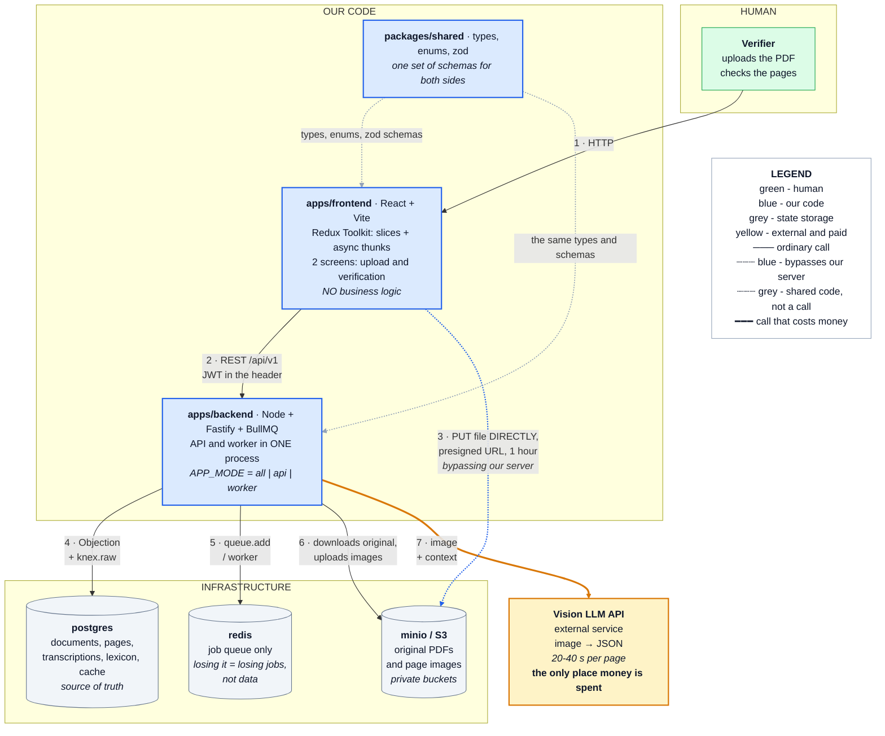
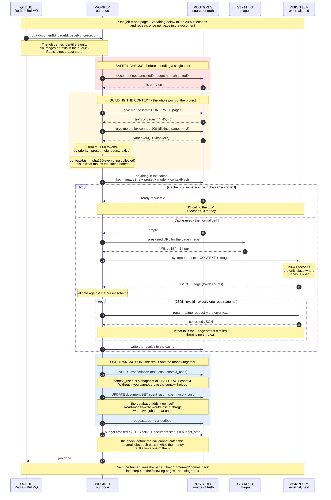
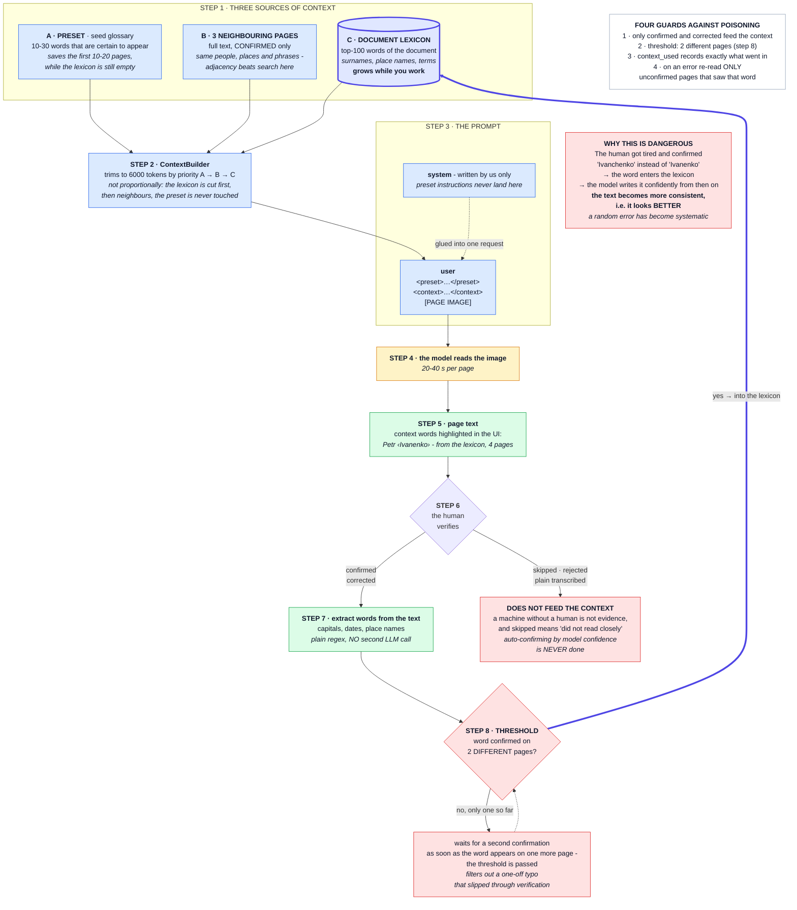
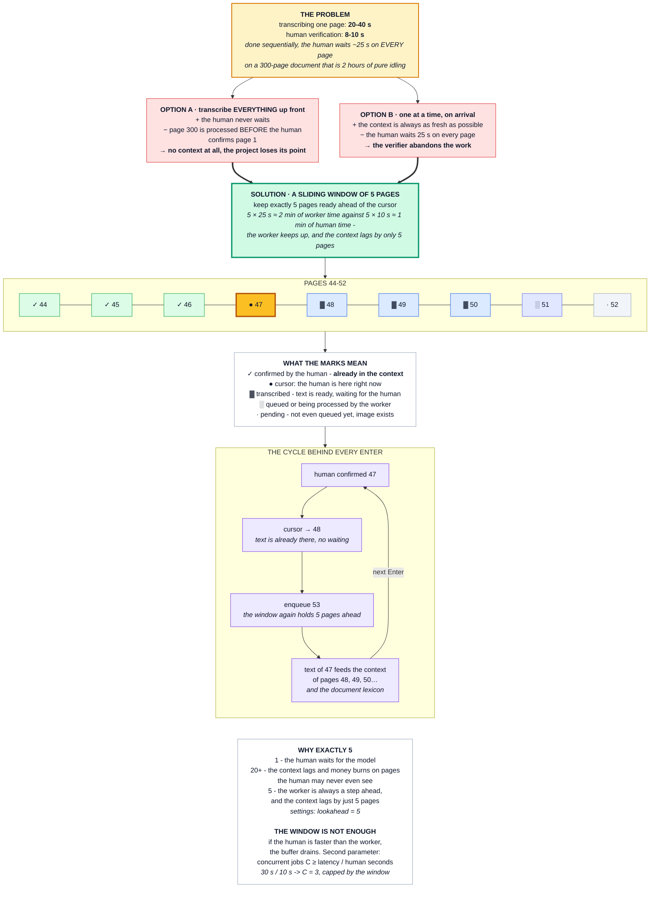
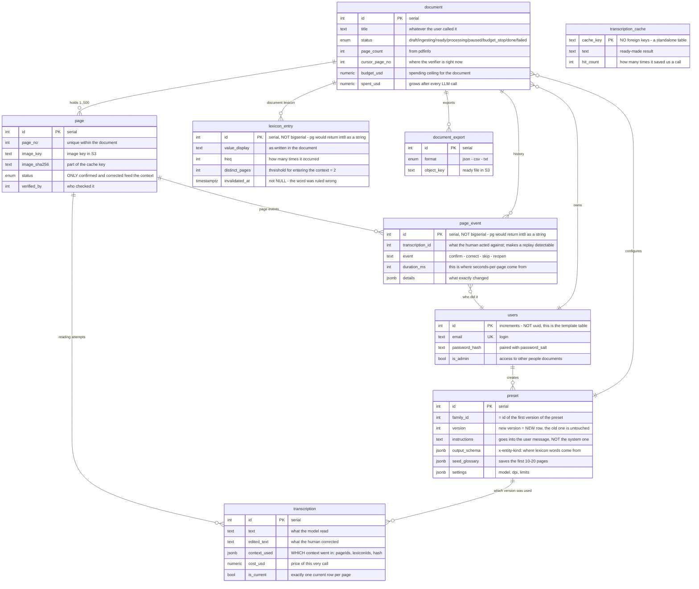
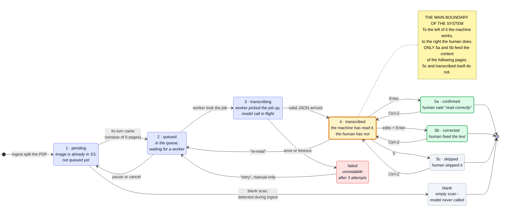

# Diagrams

Seven diagrams that together describe how Transcripta is meant to work.
**The source of truth is the `.mmd` files** in this folder; they are duplicated
here so that the explanation sits right under the picture.

| #                              | Diagram                                                  | Answers the question                             |
| ------------------------------ | -------------------------------------------------------- | ------------------------------------------------ |
| [1](#1--system-overview)       | [01-overview.mmd](01-overview.mmd)                       | What the system is made of and who talks to whom |
| [2](#2--data-pipeline)         | [02-data-pipeline.mmd](02-data-pipeline.mmd)             | **The file's path from upload to export**        |
| [3](#3--processing-one-page)   | [03-transcribe-sequence.mmd](03-transcribe-sequence.mmd) | Who calls whom during transcription              |
| [4](#4--context-learning)      | [04-context-learning.mmd](04-context-learning.mmd)       | **How confirmed pages improve the next ones**    |
| [5](#5--sliding-window)        | [05-sliding-window.mmd](05-sliding-window.mmd)           | Why the human never waits for the model          |
| [6](#6--database-schema)       | [06-database.mmd](06-database.mmd)                       | Which tables exist and how they are linked       |
| [7](#7--life-of-a-single-page) | [07-page-states.mmd](07-page-states.mmd)                 | Which states a page passes through               |

## Shared legend

The same on every diagram.

| Colour          | What it means                                                |
| --------------- | ------------------------------------------------------------ |
| green           | the human, or a decision they confirmed                      |
| blue            | our code and our data                                        |
| yellow / orange | worker activity; an orange frame means work with the context |
| red             | an exit with an error, a prohibition or a safety valve       |
| grey, white     | storage, a neutral state or an explanatory panel             |

| Line          | What it means                                                       |
| ------------- | ------------------------------------------------------------------- |
| thin `-->`    | an ordinary step                                                    |
| thick `==>`   | a key transition: another process, another moment in time           |
| dashed `-.->` | not a call but a logical link: feedback, a prohibition, shared code |
| **red**       | the context feedback loop — the reason the project exists           |

The white framed panels ("HOW TO READ THIS", "LEGEND", "FOUR GUARDS", "WHY
EXACTLY 5") are hints on the picture itself, not part of the flow. They
deliberately have no arrows pointing at them.

---

# 1 · System overview

**Question:** what the system is made of and who talks to whom.



## How to read it

Four zones: the human, our code, the infrastructure, the external service.
Everything inside the "OUR CODE" frame we write from scratch; the rest we
configure. The numbers on the arrows show the order in which they come into
play.

| #   | Arrow              | What happens                                                             |
| --- | ------------------ | ------------------------------------------------------------------------ |
| 1   | human → frontend   | Opens the page in a browser                                              |
| 2   | frontend → backend | REST `/api/v1`, JWT in the header                                        |
| 3   | frontend ┈┈ S3     | The browser puts the PDF **straight into storage**, bypassing our server |
| 4   | backend → postgres | Documents, pages, transcriptions, lexicon, cache                         |
| 5   | backend → redis    | The job queue                                                            |
| 6   | backend → S3       | The worker downloads the original and uploads page images                |
| 7   | backend ━━ LLM     | Image + context. The only place money is spent                           |

The dashed arrows from `packages/shared` have no numbers: they are not calls
but shared code that both sides import at build time.

## What matters here

- **`apps/backend` is one process** hosting both the HTTP API and the queue
  worker. They can be split apart with a single `APP_MODE` variable, but by
  default it is one container.
- **`packages/shared` is not a third service.** It is an npm workspace with
  types, enums and zod schemas; at runtime it does not exist as a separate
  unit.
- **The file never goes through our server.** A presigned URL is a signed link
  valid for an hour that lets the browser write into the bucket itself.
  Otherwise a 500 MB PDF has to be pushed through Node's memory.
- **Redis is not storage.** The queue holds identifiers only. Losing Redis
  means losing unfinished jobs, not data.
- **The arrows `frontend → postgres`, `frontend → redis`, `frontend → LLM` are
  missing on purpose.** The frontend has neither the provider key nor database
  access.

---

# 2 · Data pipeline

**Question:** what happens to a file from the moment the user picks it to a
finished export. This is the document's main diagram.

```mermaid
%% DATA PIPELINE - the main diagram
%% The path of a single file from upload to a finished transcription
%% Reads LEFT TO RIGHT across phases, DOWN through the steps inside a phase
%% Step numbers 1-23 match the walkthrough in diagrams/README.md, section 2

flowchart LR
    LEG["<b>HOW TO READ THIS</b><br/>&nbsp;<br/>→ right: 4 phases,<br/>4 different executors<br/>↓ down: steps inside a phase<br/>&nbsp;<br/>([oval]) start / end<br/>[rectangle] action<br/>{diamond} branch<br/>&nbsp;<br/>─── step inside a phase<br/>━━━ transition between phases<br/>┈┈┈ logical link, not a call<br/>&nbsp;<br/>red - exit with an error<br/>green - free of charge<br/>orange - context,<br/>the heart of the system"]

    subgraph upload["PHASE 1 · UPLOAD"]
        direction TB
        START(["User picked<br/>a PDF and a preset"])
        START --> A1["<b>1</b> · POST /api/v1/documents<br/>check size and type<br/><i>before the upload, not after</i>"]
        A1 --> A2["<b>2</b> · create document<br/>status: draft"]
        A2 --> A3["<b>3</b> · hand back a presigned URL<br/><i>the signature lives 1 hour</i>"]
        A3 --> A4["<b>4</b> · browser puts the file<br/>DIRECTLY into S3<br/><i>bypassing our server</i>"]
        A4 --> A5["<b>5</b> · POST /api/v1/documents/:id/ingest<br/>enqueue the job"]
    end

    subgraph ingest["PHASE 2 · SPLITTING · job document.ingest"]
        direction TB
        B0["<b>6</b> · download the file from S3<br/><i>into a temp file, not into memory</i>"]
        B0 --> B1["<b>7</b> · pdfinfo:<br/>how many pages?"]
        B1 --> B2{"more than<br/>500?"}
        B2 -->|"yes"| BERR["error:<br/>document too large<br/><i>a deliberate limit</i>"]
        B2 -->|"no"| B3["<b>8</b> · LOOP one page at a time<br/><i>never render the whole PDF at once</i>"]
        B3 --> B4["pdftoppm -f n -l n<br/><i>separate process, 60 s timeout</i>"]
        B4 --> B5["sharp: greyscale, 2048 px, webp<br/>+ 256 px thumbnail for the strip<br/><i>~200 KB instead of 4 MB</i>"]
        B5 --> B6["blank? sharp stats, stdev below threshold<br/>upload both images to S3<br/>+ sha256 of the NORMALISED one"]
        B6 --> B7["INSERT page · status: pending<br/><i>or blank - never queued, never sent</i>"]
        B7 -->|"more pages left"| B3
        B7 --> B8["<b>9</b> · document.status = ready<br/>enqueue the first 5 pages<br/><i>why 5 - diagram 5</i>"]
    end

    subgraph transcribe["PHASE 3 · TRANSCRIPTION · job page.transcribe"]
        direction TB
        C0{"<b>10</b> · document<br/>not cancelled?"}
        C0 -->|"cancelled"| CSTOP["exit,<br/>do not spend money"]
        C0 -->|"ok"| C1{"<b>11</b> · budget<br/>not exhausted?"}
        C1 -->|"exhausted"| CBUD["stop the WHOLE document,<br/>not just one page"]
        C1 -->|"ok"| C2

        FEEDIN[("WHERE THE CONTEXT COMES FROM<br/>document lexicon + texts of<br/>confirmed pages<br/><b>filled by PHASE 4, step 21</b>")]
        FEEDIN -.->|"read"| C2

        C2["<b>12</b> · BUILD THE CONTEXT<br/>1. seed glossary from the preset<br/>2. 3 confirmed neighbouring pages<br/>3. document lexicon top-100<br/><i>trim to 6000 tokens by priority</i>"]
        C2 --> C3{"<b>13</b> · read this before?<br/><i>cache key = image sha + preset<br/>+ model + context hash</i>"}
        C3 -->|"yes"| CHIT["take it from the cache<br/><b>0 seconds, 0 money</b>"]
        C3 -->|"no"| C4["<b>14</b> · prompt: system + preset<br/>+ context + image"]
        C4 --> C5["<b>15</b> · LLM call<br/><i>the only place money is spent</i>"]
        C5 --> C6{"<b>16</b> · valid JSON<br/>against the schema?"}
        C6 -->|"no · 1 attempt"| C7["repair request<br/>with the validator error text"]
        C7 --> C6
        C6 -->|"yes"| C8["<b>17</b> · ONE transaction:<br/>INSERT transcription + context_used<br/>spent_usd += cost (atomic UPDATE)<br/><i>record WHICH context went in</i>"]
        CHIT --> C8
        C8 --> C9["<b>18</b> · page.status = transcribed<br/>budget re-checked AFTER the charge<br/><i>crossed → budget_stop for the whole doc</i>"]
    end

    subgraph verify["PHASE 4 · HUMAN VERIFICATION"]
        direction TB
        D0["<b>19</b> · image and text side by side,<br/>context words highlighted<br/><i>you can see what the model was told</i>"]
        D0 --> D1{"<b>20</b> · human<br/>decision"}
        D1 -->|"Enter"| D2["confirmed<br/><i>read correctly</i>"]
        D1 -->|"edits + Enter"| D3["corrected<br/><i>fixed by the human</i>"]
        D1 -->|"S"| D4["skipped<br/><i>did not read closely</i>"]

        D2 --> D5["<b>21</b> · EXTRACT WORDS into lexicon_entry<br/>surnames, place names, terms<br/><i>without a second LLM call</i>"]
        D3 --> D5
        D4 -.->|"does NOT feed the context"| D6

        D5 -.->|"FEEDBACK"| FEEDOUT[("THE SAME LEXICON<br/>confirmed text returns<br/>into the prompt of later pages<br/><b>→ back to step 12</b><br/><i>the point of the project</i>")]
        D5 --> D6["<b>22</b> · cursor moves to the next page<br/>+ enqueue one more page ahead"]
        D6 ==>|"next page<br/>of the same document"| NEXT(["↺ back to PHASE 3, step 10,<br/>but with a new context"])
    end

    A5 ==>|"job in Redis"| B0
    B8 ==>|"a job for EVERY page"| C0
    C9 ==>|"page appeared in the UI"| D0

    D6 --> E1["<b>23</b> · export<br/>JSON / CSV / TXT<br/><i>only once every page is closed</i>"]
    E1 --> END(["Done"])

    LEG ~~~ upload

    classDef upl fill:#dbeafe,stroke:#2563eb,color:#0f172a
    classDef work fill:#fef3c7,stroke:#d97706,color:#0f172a
    classDef human fill:#dcfce7,stroke:#16a34a,color:#0f172a
    classDef bad fill:#fee2e2,stroke:#dc2626,color:#0f172a
    classDef good fill:#d1fae5,stroke:#059669,stroke-width:2px,color:#0f172a
    classDef star fill:#ffedd5,stroke:#ea580c,stroke-width:3px,color:#0f172a
    classDef info fill:#ffffff,stroke:#94a3b8,color:#0f172a
    classDef skip fill:#f1f5f9,stroke:#94a3b8,color:#0f172a

    class A1,A2,A3,A4,A5 upl
    class B0,B1,B3,B4,B5,B6,B7,B8,C4,C5,C7,C8,C9,E1 work
    class D0,D2,D3,D6 human
    class BERR,CSTOP,CBUD bad
    class D4 skip
    class CHIT good
    class C2,D5 star
    class FEEDIN,FEEDOUT feed
    class NEXT loopc
    class LEG info

    classDef feed fill:#fee2e2,stroke:#dc2626,stroke-width:3px,color:#0f172a
    classDef loopc fill:#ccfbf1,stroke:#0f766e,stroke-width:2px,color:#0f172a

    %% the two halves of the project's main link: 19 (read) and 37 (replenish)
    linkStyle 19 stroke:#dc2626,stroke-width:4px
    linkStyle 37 stroke:#dc2626,stroke-width:4px
    %% transition to the next page of the same document
    linkStyle 39 stroke:#0f766e,stroke-width:3px
```



## How to read it

**Right for phases, down for the steps inside a phase.** The four frames are
four different executors, each on its own timescale:

| Phase                          | Who executes it                         | How long it takes      | How often per document |
| ------------------------------ | --------------------------------------- | ---------------------- | ---------------------- |
| 1 · Upload (steps 1-5)         | Browser + HTTP                          | seconds                | 1                      |
| 2 · `document.ingest` (6-9)    | The worker, one job                     | minutes                | 1                      |
| 3 · `page.transcribe` (10-18)  | The worker, **a separate job per page** | 20-40 s                | once per page          |
| 4 · Human verification (19-22) | Browser + human                         | target < 10 s per page | once per page          |

## What matters here

**Cheap checks come before expensive ones.** Steps 10 and 11 are two database
queries made before spending 20-40 seconds and money on a model call. Without
them a cancelled 300-page document still works through its remaining 250 jobs.

**Splitting happens one page at a time** (step 8). 500 pages opened at once is
several gigabytes in memory and a dead process. A separate subprocess per page
gives bounded memory, a real timeout and the failure of exactly one page
instead of the whole document.

**The charge is part of step 17, not a step of its own.** The transcription,
`context_used` and `spent_usd += cost` are written in one transaction; the
budget is then re-checked _after_ the charge, because concurrent jobs each pass
the "before" check separately and together can cross the ceiling.

**The cache check comes after context building, not before** (steps 12 → 13).
The cache key contains the context hash, so the context has to be assembled
before there is anything to hash. The consequence is correct: the human
confirmed one more page → the context differs → the cache misses, because the
model's answer should differ too.

**The two red cylinders are the same storage.** The feedback loop is cut in
half so that the phases stay in left-to-right reading order. The complete loop
is drawn on diagram 4.

---

# 3 · Processing one page

**Question:** who calls whom inside phase 3 and in what order.



## How to read it

The vertical lines are participants; they live for the whole job. A solid arrow
is a request, a dashed one is a response.

| Element              | What it means                                    |
| -------------------- | ------------------------------------------------ |
| **red** rectangle    | safety checks: verifications before any spending |
| **yellow** rectangle | building the context                             |
| `alt / else`         | mutually exclusive branches: cache hit / miss    |
| `opt`                | an optional block: only when the JSON is invalid |
| a yellow note        | local worker activity or an explanation          |

Only messages between participants are numbered. Local work (trimming the
context, hashing, validation) is moved into notes and has no numbers.

## What matters here

- **The job carries identifiers only.** Put a base64 image into the queue and
  Redis hits its memory limit, taking every unfinished job with it.
- **`contextHash` must be deterministic.** If a timestamp or an unordered word
  list gets into it, the cache **silently** stops working: there will be no
  error in the logs, only double the spending.
- **A repair is not a retry.** Repeating the same prompt is pointless — it will
  deterministically produce the same result. The repair adds the validation
  error text. There is exactly one attempt.
- **`context_used` is written together with the result.** Without it there is
  no way to answer which pages were affected by a wrong word in the lexicon.

---

# 4 · Context learning

**Question:** how confirmed pages make the following ones more accurate. This
is the project's core idea.



## How to read it

Eight steps from top to bottom, and at the bottom right a **thick blue arrow
loops back** into the "Document lexicon" cylinder — that is the loop closing.
One turn of the loop = one verified page.

## Three sources of context

| Source                             | What it covers                                           | When it starts helping |
| ---------------------------------- | -------------------------------------------------------- | ---------------------- |
| **Preset** — the seed glossary     | Typical surnames of the region, place names, set phrases | From page one          |
| **3 confirmed neighbouring pages** | The same people, places, formulas                        | From roughly page 4    |
| **Document lexicon**, top-100      | The whole document                                       | From roughly page 10   |

Neighbouring pages are not a lazy stand-in for smart search. Handwritten
documents are locally coherent: pages 47-49 of a parish register contain the
same surnames as page 50. Vector search runs into the fact that **the query is
an image**: there is no text to search with yet, obtaining it is the task.

## What matters here

**Only `confirmed` and `corrected` feed the context.** Not `transcribed` —
that is a machine without a human. Not `skipped` — the human did not read
closely. And never auto-confirmation by model confidence: confidence correlates
poorly with correctness precisely on rare surnames, where the cost of a mistake
is highest.

**The two-distinct-pages threshold.** A word enters the lexicon not after the
first confirmation but after appearing on 2 different pages. A surname
mentioned 30 times on one page may be a single mistake repeated inside a table.

**Context poisoning is the main danger of the system.** A confirmed mistake
enters the lexicon, the model confidently repeats it on the following pages,
and the text becomes more consistent — that is, it looks _better_. There are
four guards against this, listed on the diagram itself.

---

# 5 · Sliding window

**Question:** why the human never waits for the model, and why the window is
exactly 5 pages.



## How to read it

This is not a data flow but an **argument**: the problem → two obvious
solutions, each of which breaks → the one that works. The "PAGES 44-52" frame
is a snapshot of the page strip at one moment; the marks are decoded in the
panel below it.

## What matters here

Transcription takes 20-40 seconds, human verification 8-10. Done sequentially,
the human waits on every page. Both obvious ways out break: transcribe
everything at once and there is no context at all; do it one at a time and the
human leaves.

The sliding window keeps 5 pages ready ahead of the cursor. The trade-off is
direct: **a larger window means less waiting but an "older" context**, because
pages inside the window are already transcribed and will never see a fresh
confirmation.

The cursor position is stored in the database (`document.cursor_page_no`) —
close the tab and nothing is lost.

The window alone is not enough: if the human consumes pages faster than the
worker produces them, the buffer empties. The second parameter is how many
`page.transcribe` jobs run at once, and it is derived rather than guessed:
`C ≥ latency / human-seconds-per-page`, which gives C = 3 for a 30-second
transcription. It is capped by the window size — more workers than the window
holds have nothing to take — and by the provider's rate limit
([02-data-pipeline.md](../02-data-pipeline.md#the-window-alone-is-not-enough--concurrency-is-the-second-parameter)).

---

# 6 · Database schema

**Question:** which tables exist and how they are related.



## How to read it

`A ||--o{ B` means "one A has zero or more B". `document` sits at the centre of
the schema: pages, the lexicon and exports grow out of it, and transcriptions
and events grow out of a page. The fourth column in each table says **why the
field exists**, not what its type is.

The full DDL is [schema/schema.sql](../schema/schema.sql).

## Nine tables

| Table                 | What it stores                                       | Key characteristic                                           |
| --------------------- | ---------------------------------------------------- | ------------------------------------------------------------ |
| `users`               | Users                                                | **From the template.** Integer PK, a ready auth module       |
| `preset`              | Settings for a document type                         | **The row is never updated** — a new version means a new row |
| `document`            | File, status, budget, cursor                         | `cursor_page_no` — where the verifier is now                 |
| `page`                | A page: image, status, who verified it               | `image_sha256` — part of the cache key                       |
| `transcription`       | What the model read + edits + which context was used | `is_current` — exactly one current row per page              |
| `lexicon_entry`       | Document lexicon with frequencies                    | `distinct_pages` — the threshold for entering the context    |
| `page_event`          | Action history, append-only                          | `duration_ms` — the headline product metric                  |
| `transcription_cache` | So we never pay twice for the same thing             | In Postgres, not Redis                                       |
| `document_export`     | Generated exports                                    | The file is in S3, the key is here                           |

## What matters here

**`transcription_cache` stands apart with no lines at all** — that is
deliberate, and on the diagram it is pushed aside so that no edge passes near
it. The cache has no foreign keys because it must survive the deletion of a
document; its key is not an id but a hash of the content.

**Four foreign keys from `schema.sql` are drawn as fields rather than lines**,
so as not to clutter the schema:

| Key                                           | Where it is on the diagram                                                     |
| --------------------------------------------- | ------------------------------------------------------------------------------ |
| `page.verified_by → users`                    | the `verified_by` field ("who verified it")                                    |
| `document_export.requested_by → users`        | not shown: a technical field                                                   |
| `transcription.document_id → document`        | denormalised for fast queries; the path is visible through `page`              |
| `page_event.transcription_id → transcription` | the `transcription_id` field; it exists for the `page_event_once` unique index |

**Every key is an integer, and that is a consequence rather than a choice.**
The template's base model `abstract.model.ts` declares `public id!: number`.
Domain models extend it for the `createdAt`/`updatedAt` hooks, so their primary
keys are `integer` too. The price is that ids in URLs are sequential and
guessable, so the document ownership check is mandatory on every route that
accepts an id.

**The lexicon belongs to a document, it is not global.** "Ivanenko" from one
parish must not leak into another document. Carrying words between documents
happens through the preset's seed glossary.

**`context_used` is the most important field in the schema.** It records which
pages and which words went into the prompt. Find a mistake in the lexicon and
you can locate exactly the affected pages instead of recomputing the whole
document.

**Several transcriptions per page are normal.** Re-runs do not overwrite the
earlier ones; the current one is marked `is_current`, and the database itself
guarantees there is only one.

---

# 7 · Life of a single page

**Question:** which states a page passes through from being cut out of the PDF
to being finished with.

Every rectangle is one value of the `page.status` field in the database. Every
arrow is one permitted transition; its label is the event that causes it.
Anything not on the diagram is forbidden.



## How to read it

**The happy path runs left to right, steps 1 → 2 → 3 → 4 → 5.** This is what
happens to a page when all goes well:

1. `pending` — the image was cut out of the PDF and put into storage, not
   queued yet;
2. `queued` — its turn came, the page is waiting for a worker;
3. `transcribing` — a worker picked it up, the model call is in flight;
4. `transcribed` — the model has read it, now the page waits for a human;
5. the human's decision: `confirmed` (5a), `corrected` (5b) or `skipped` (5c).

Above and below that line are the deviations:

| State    | When it occurs                                           |
| -------- | -------------------------------------------------------- |
| `blank`  | There is nothing on the page. The model was never called |
| `failed` | Three attempts failed. It can only be re-queued manually |

The backward arrows are undo: `Ctrl+Z` returns a page from the human's decision
to `transcribed`, "re-read" sends it for a new transcription, and pausing
returns it from the queue to `pending`.

## What matters here

**`transcribed` is the boundary between machine and human.** To the left of it
the system does everything, to the right the human does. And it is here that it
is decided what feeds the context of the following pages:

| State             | Into the context? | Why                                                            |
| ----------------- | ----------------- | -------------------------------------------------------------- |
| `confirmed`       | ✓                 | The human looked and said "correct"                            |
| `corrected`       | ✓                 | The human looked and fixed it — the most reliable source       |
| `skipped`         | ✗                 | The human did not read closely; their consent confirms nothing |
| `transcribed`     | ✗                 | A machine without a human                                      |
| `blank`, `failed` | ✗                 | There is no text                                               |

**`failed` does not block the document.** The other pages keep being read while
this one waits for a "retry" button. There is deliberately no automatic
resurrection: if a page will not read, an auto-retry simply spends the money
three times.

**`Ctrl+Z` moves the page back but deliberately does not touch the lexicon.**
It is tempting to expect the counters to be rolled back too, and that turns out
to be the wrong instinct: `freq` and `distinct_pages` are shared between pages,
so a word may have arrived from five of them. Decrementing blindly corrupts the
counters for the other four.

So an undo returns the page to `transcribed` and clears `verified_by`, while
the words it contributed stay in the lexicon. If one of them is actually wrong,
the way to remove it is the existing "this word is wrong" button
(`POST /lexicon/:id/invalidate`), which is precise and already has to exist for
context poisoning anyway. See
[06-verification-ui.md](../06-verification-ui.md#ctrlz-does-not-roll-back-the-lexicon).

---

## One idea across several diagrams

| Idea                                 | Where to look                                                                                                |
| ------------------------------------ | ------------------------------------------------------------------------------------------------------------ |
| The context feedback loop            | 4 (the whole loop), 2 (cut in half), 5 (step 4 of the cycle), 7 (the note)                                   |
| Only `confirmed` / `corrected`       | 4, 6 (the comment on `page.status`), 7 (the table above)                                                     |
| Cost control                         | 1 (the single arrow to the LLM), 2 (steps 10, 11, 13), 3 (safety checks and the cache)                       |
| Why the queue holds identifiers only | 1, 3 (the note above the worker)                                                                             |
| Context poisoning                    | 4 (the "why this is dangerous" and "four guards" panels), 6 (`invalidated_at`, `context_used`), 7 (`Ctrl+Z`) |

## Checking that they render

```bash
for f in docs/diagrams/*.mmd; do
  npx -p @mermaid-js/mermaid-cli mmdc -i "$f" -o "/tmp/$(basename $f .mmd).svg"
done
```
